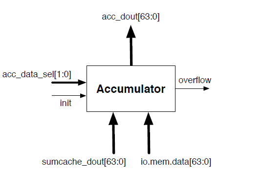
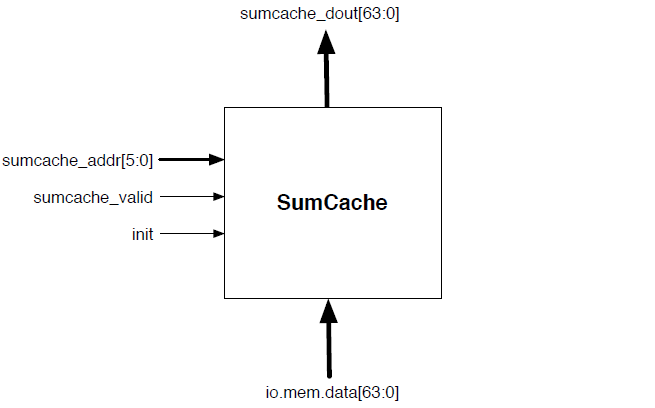
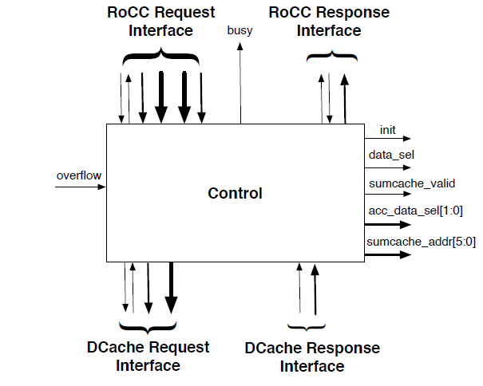

### Matrix Sum

The lab 3 of `CS250` in fall 13. Need to study the lab 2 discussion material of spring 17.

Some Changes: 

+ `rocc.scala`-> `tile/LazyRoCC.scala`
+ `nbdcache.scala`->`rocket/HellaCache.scala`

Requirements:

+ an n-by-n matrix consisting of 64-bit unsigned integers (maximum  size = 64) **FIX: up to 31 because the width of rs2 is 5** (pow(2,5)=32).

+ access memory to fetch the relevant elements of the matrix

+ return the sum of the relevant row sum and column sum to the core. If overflow, then return 2^64-1.

+ record three partial column sums if any row sun is called firstly or vice versa.

+ opcode: assume in custom 0 (`inst[6:0]=00_010_11`), 

  | `INSTRUCTIONS` | `funct7` | `rs2` | `rs1` | `xd` \& `xs1` \& `xs2` | `rd`  | `opcode` |
  | -------------- | -------- | ----- | ----- | ---------------------- | ----- | -------- |
  | `SETUP`        | 0000000  | ????? | ????? | 011                    | ????? | 0001011  |
  | `ROWSUM`       | 0000001  | ????? | ????? | 110                    | ????? | 0001011  |
  | `COLSUM`       | 0000010  | ????? | ????? | 110                    | ????? | 0001011  |

+ Submodules(original)

  + accumulator: to handle overflow, use a 65-bit adder.(**FIX: 32-bit**) If reach a overflow, signal the control

    

  + sum cache to storage  the partial sums

    

  + control

    
    
  
+ Submodules(mimic `SHA3`)